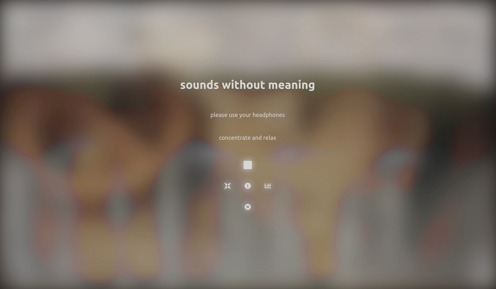

# sounds without meaning

https://swom.app

Sounds without meaning uses simple algorithms to compose an infinite stream of acoustic and visual impressions from fused industrial sounds and images. The impressions of the sounds and colors are meant to serve distraction and relaxation without imparting knowledge or inviting creativity. Sounds without meaning wants to bind the attention of the listeners without saying anything concrete. The aim is to create a space in which listeners can let themselves fall, in which they can be attentive without being challenged, in which they can be inattentive without neglecting anything. The author originally created the application for his personal use, aligned it to his own subjective feelings and needs, and finally published it as open source software.

Sounds without meaning was developed in Javascript on the basis of the React Framework and runs directly in the web browser. It is a Progressive Web App (PWA) that can also be installed locally on compatible devices. Data of the LWL-Industriemuseum, the Museum für Druckkunst Leipzig and own data of the author were used. All data and the software are available under free licenses.

## Data

Subfolders \*/lwl/\*: CC BY 4.0 by LWL-Industriemuseum and Person, who made the recording / photograph, source: https://codingdavinci.de/daten/#lwl-industriemuseum

Subfolders \*/mfd/\*: CC BY-SA 3.0 DE by Museum für Druckkunst Leipzig, source: https://codingdavinci.de/daten/#druckkunst_museum

Subfolders \*/pgw/\*: CC BY 4.0 by Leander Seige

## Source Code

This project was bootstrapped with [Create React App](https://github.com/facebook/create-react-app).

Get the source code and all data: 
**`git clone 'https://github.com/leanderseige/soundswithoutmeaning'`**

Install dependencies: 
**`npm install`**

Run the app in the development mode. 
Open [http://localhost:3000](http://localhost:3000) to view it in the browser. 
**`npm start`**

Build the app for production to the `build` folder. 
It correctly bundles React in production mode and optimizes the build for the best performance. 
**`npm run build`**
